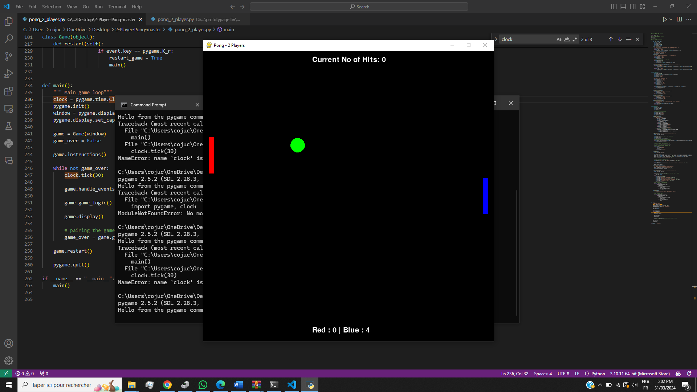
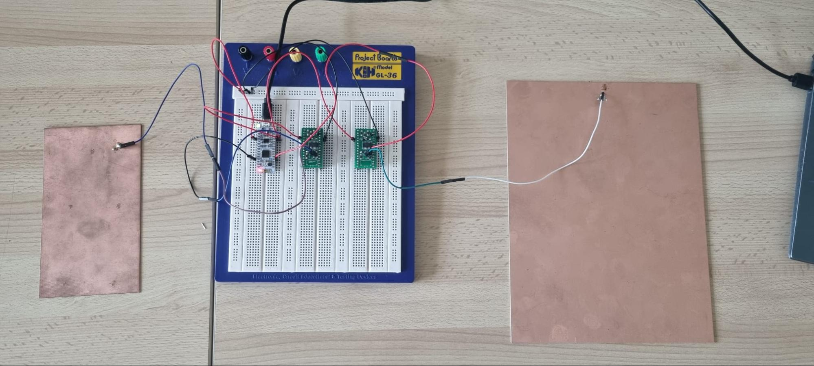

# Pong Game Project

This repository contains a modified version of the classic Pong game, developed as part of a prototyping module. The project combines software with hardware using an STM32 microcontroller and capacitive sensors to create a unique paddle control system where players use hand movements to control their paddles.

## Overview

This Pong game is controlled through proximity sensors using an STM32 microcontroller and metal electrodes. Each player adjusts the position of their paddle by moving their hand over a copper electrode, with the STM32 detecting the distance and sending data to the game application in real time.

### Features
- **Capacitive Sensing Control:** Players control their paddles by moving their hands near metal electrodes.
- **STM32 Microcontroller Integration:** The STM32 microcontroller captures proximity data and transmits it via UART to the Python game application.
- **Two-Player Gameplay:** Supports two players for competitive gameplay.
- **Real-Time Score Tracking:** Displays each player's score and winner notifications on-screen.

## Hardware Setup

1. **Electrodes and Signal Conditioning Circuits**:
   - Use two copper electrodes, one for each player, positioned in a way to detect hand proximity.
   - Each electrode connects to a conditioning circuit that converts the capacitive signal to a digital signal readable by the microcontroller. This circuit uses a current-to-voltage converter and a hysteresis comparator in a feedback loop, producing a stable oscillation signal that changes based on hand distance.

2. **STM32 Microcontroller (Nucleo F301K8)**:
   - Connect the output from each electrode’s conditioning circuit to the STM32 Nucleo F301K8 microcontroller.
   - The STM32 measures the oscillation frequency, which varies with hand proximity, and processes this data.
   - The microcontroller is programmed to transmit this processed data over UART to the game application running on a computer.

3. **Communication Setup**:
   - Connect the STM32 microcontroller to your computer via USB, enabling UART communication for data transmission.
   - In STM32CubeIDE, configure the UART for serial data output to match the baud rate expected by the game application.

   The STM32 microcontroller will send the frequency data for each player’s paddle as a formatted serial output, read by the Python game application to control the paddle movement dynamically.

## Software Setup and Installation

### Requirements
- **Python 3.x**
- **Pygame** and **PySerial** libraries for Python

Install the required libraries with:
```bash
pip install pygame pyserial
```

### Running the Game

1. **Upload the STM32 Firmware**:
   - Open the `.mxproject` file in STM32CubeIDE.
   - Build and flash the firmware to the STM32 microcontroller to enable hand distance measurement.
   - Ensure the microcontroller is powered on and connected to the computer, ready for UART communication.

2. **Start the Game**:
   - After connecting and running the STM32 microcontroller, run the game with:
     ```bash
     python pong.py
     ```

This sequence ensures that the game receives paddle control data from the microcontroller before launching the Pong game interface.

## Game Controls

Each player controls their paddle by adjusting hand distance:
- **Left Paddle (Red Player):** Moves based on the proximity detected by the first electrode.
- **Right Paddle (Blue Player):** Moves based on the proximity detected by the second electrode.

In-game commands:
- **Press `Space`** to start the game.
- **Press `R`** to restart after a game ends.
- **Press `Esc`** to quit the game.

## System Components

1. **STM32 Microcontroller Code**:
   - The STM32 reads capacitance data and transmits paddle positions over UART.
   - The firmware files include `main.c`, which manages input capture, UART communication, and signal processing, along with necessary system configuration files for peripheral setup.

2. **Python Game Code**:
   - The game logic, graphics, and player input handling are implemented in `pong.py`.
   - Pygame renders the game interface, while PySerial reads data from the STM32 and adjusts paddle positions accordingly.

## Images


- **Game Interface**: Screenshots of the game.



- **Hardware Setup**: The STM32 setup with metal plates.

## License
This project is open-source and available under the MIT License.
